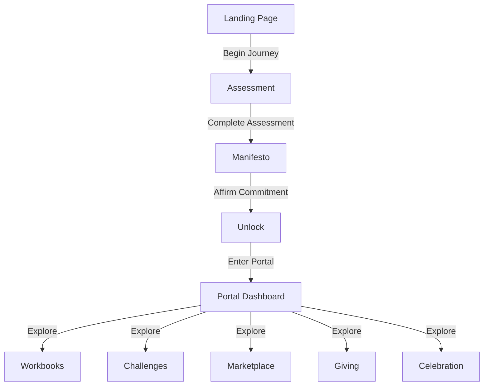

# The Wealth Shift: Site Map & User Flow

This document outlines the structure, navigation flow, and key features of The Wealth Shift website. It serves as a reference for understanding how users move through the site and what functionality is available at each stage.

## Site Structure Overview

```
The Wealth Shift
├── Landing Page (/)
├── Assessment (/assessment)
├── Manifesto (/manifesto)
├── Unlock (/unlock)
└── Portal (/portal)
    ├── Workbooks (/portal/workbooks)
    ├── Challenges (/portal/challenges)
    ├── Marketplace (/portal/marketplace)
    ├── Giving (/portal/giving)
    └── Celebration (/portal/celebration)
```

## User Journey Flow



## Detailed Page Descriptions

### Landing Page (/)

**Purpose:** Introduce The Wealth Shift concept and invite users to begin their journey.

**Key Sections:**
1. **Hero Section**
   - Main headline and subtitle
   - Primary CTA: "Begin Your Journey" (links to Assessment)
   - Secondary CTA: "Explore More" (scrolls to next section)

2. **The Invitation Section**
   - Brief introduction to the concept
   - Three cards highlighting key aspects:
     - Assessment
     - Manifesto
     - Portal
   - CTA to continue scrolling

3. **Philosophy Section**
   - Core values and principles
   - Quote card with hover interaction
   - Final CTA to begin journey

**Navigation:** 
- Main navigation bar with links to Home, Assessment, Manifesto
- Scroll indicators between sections

**Interactive Elements:**
- Hover effects on cards and buttons
- Scroll-linked animations
- Progress bar at the top of the page

### Assessment Page (/assessment)

**Purpose:** Gather information about the user's current wealth mindset and journey.

**Key Sections:**
1. **Introduction**
   - Explanation of the assessment purpose
   - What to expect and time commitment

2. **Form Section**
   - Embedded Tally/Typeform
   - Questions about wealth mindset, goals, challenges

3. **Completion Message**
   - Thank you message
   - Direction to the Manifesto page

**Navigation:**
- Standard navigation bar
- Form navigation controls

**Interactive Elements:**
- Form input fields
- Progress indicator within the form
- Submission button

### Manifesto Page (/manifesto)

**Purpose:** Present The Wealth Shift core values and principles for user affirmation.

**Key Sections:**
1. **Introduction**
   - Explanation of the manifesto's importance
   - What commitment means

2. **Core Beliefs**
   - Intentional Growth
   - Community Support
   - Authentic Empowerment
   - Holistic Prosperity
   - Ethical Impact

3. **Commitment Form**
   - Embedded Tally/Typeform for affirming commitment
   - Checkbox or similar interaction

**Navigation:**
- Standard navigation bar
- Internal page links to different manifesto sections

**Interactive Elements:**
- Commitment form
- Styled section dividers
- Emphasis on key terms

### Unlock Page (/unlock)

**Purpose:** Welcome users who have completed the assessment and affirmed the manifesto.

**Key Sections:**
1. **Welcome Message**
   - Congratulations on completing the previous steps
   - Brief overview of what's next

2. **Welcome Video**
   - Embedded video player
   - Personal message from the founder

3. **Portal Access**
   - CTA to enter the portal
   - Preview of what's inside

4. **What to Expect**
   - List of portal sections and their purposes

**Navigation:**
- Standard navigation bar
- Primary CTA to enter portal

**Interactive Elements:**
- Video player controls
- Animated CTA button

### Portal Page (/portal)

**Purpose:** Serve as a dashboard for accessing all resources and tools.

**Key Sections:**
1. **Welcome Back**
   - Personalized greeting
   - Quick access to today's activity

2. **Resource Cards**
   - Grid of cards linking to different portal sections
   - Visual indicators for new content

3. **Progress Tracking**
   - Journey completion percentage
   - Recent activity list

4. **Help Section**
   - Contact information
   - Support resources

**Navigation:**
- Enhanced navigation bar with portal section links
- Card-based navigation to sub-sections

**Interactive Elements:**
- Progress bar
- Hover effects on cards
- Activity timeline

### Portal Sub-Pages

#### Workbooks (/portal/workbooks)

**Purpose:** Provide guided exercises and worksheets for deeper learning.

**Key Features:**
- Categorized workbook listings
- Download/view options
- Completion tracking

#### Challenges (/portal/challenges)

**Purpose:** Offer practical activities to implement learnings.

**Key Features:**
- Challenge descriptions and instructions
- Difficulty levels
- Completion tracking
- Sharing capabilities

#### Marketplace (/portal/marketplace)

**Purpose:** Showcase curated resources and offerings.

**Key Features:**
- Product/service listings
- Filtering options
- External links to offerings

#### Giving (/portal/giving)

**Purpose:** Facilitate community contribution and giving back.

**Key Features:**
- Giving opportunities
- Impact stories
- Contribution tracking

#### Celebration (/portal/celebration)

**Purpose:** Acknowledge and celebrate user achievements.

**Key Features:**
- Achievement showcase
- Milestone recognition
- Community celebrations

## Conditional Access & Gating

The site implements a progressive access model:

1. **Public Access:**
   - Landing Page

2. **Assessment Required:**
   - Manifesto Page

3. **Manifesto Affirmation Required:**
   - Unlock Page

4. **Full Journey Completion Required:**
   - Portal and all sub-pages

## Technical Implementation Notes

- **Gating Mechanism:** Currently using redirect logic rather than full authentication
- **Form Integration:** Tally/Typeform with redirect on completion
- **Video Hosting:** YouTube embed with custom player styling
- **Portal Access:** Currently simulated; will be enhanced with actual authentication in future phases

## Future Enhancements

- **User Accounts:** Personal profiles and progress tracking
- **Community Features:** Forums, messaging, group activities
- **Content Personalization:** Tailored recommendations based on assessment
- **Mobile App:** Dedicated application for on-the-go access

---

This site map will be updated as the project evolves to reflect new features, pages, and user flow changes.
